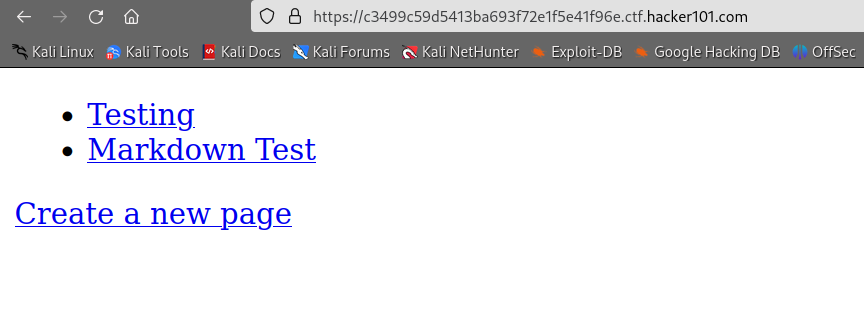

# Micro-CMS v1

<figure><figcaption></figcaption></figure>

Navigate to Testing:

<figure><figcaption></figcaption></figure>

Go to Edit this page link:

<figure><figcaption></figcaption></figure>

In the link query, let's try to change the edit page index: edit/1 -> edit/n

* we got error code 404 until we reached /edit/7, here we can find our flag!

<figure><figcaption></figcaption></figure>
